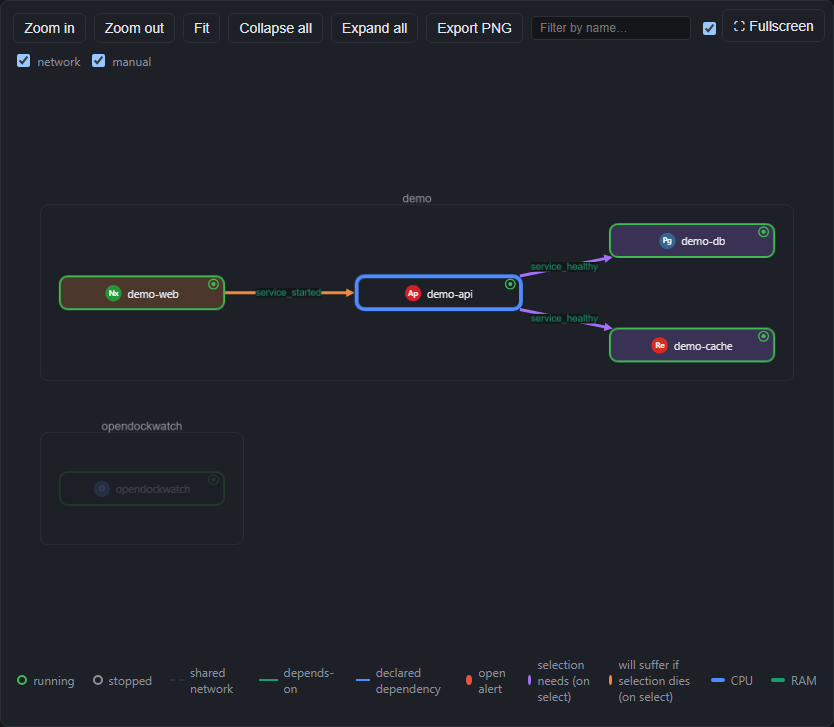
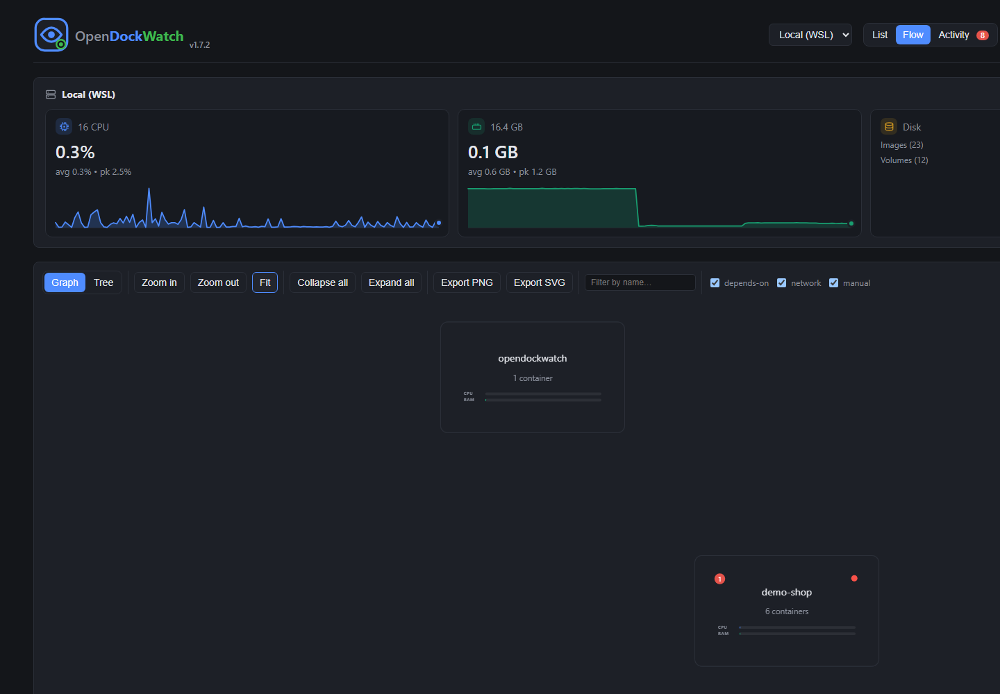
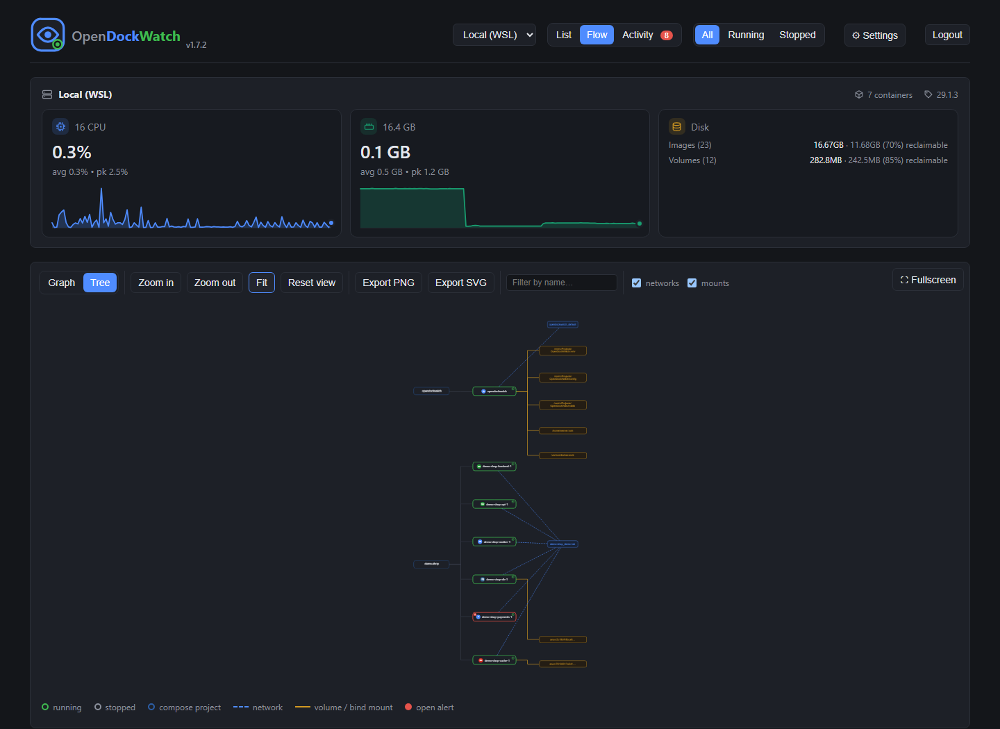
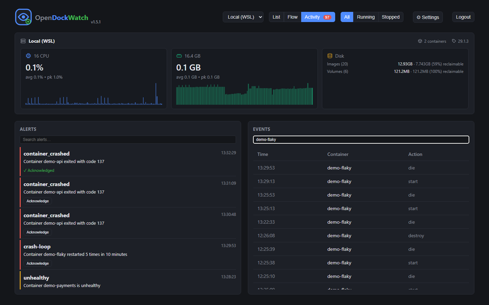

# OpenDockWatch

A small self-hosted Docker dashboard: containers grouped by Compose project, CPU/memory stats, start/stop/restart, live log tailing, and an ArgoCD-style topology view of how containers relate to each other. Works against the local Docker daemon and any number of remote hosts over SSH. No orchestration, no scheduling, no Kubernetes — just visibility and basic control, in the spirit of Dozzle.

## Features

- **List view** — containers grouped by `docker compose` project (collapsible), with live CPU/memory columns, a one-click Logs button straight to the Log Viewer, and Start/Stop/Restart actions. Filter by All / Running / Stopped.
- **Flow view** — a graph of containers, grouped visually by compose project, with zoom/fit controls, a name filter, per-edge-kind toggles, PNG/SVG export, and a Fullscreen toggle that hides the host stats card so the graph gets the room. Nodes show a state indicator, an uptime/status string, live CPU/RAM bars, network/disk I/O as current rates (not lifetime totals), published ports, and a badge for open alerts.
  - **PNG export** — captures exactly what's currently framed on screen (zoom/pan in first to crop to a specific area), at 2x pixel density for crisp text and lines.
  - **SVG export** — a vector alternative with no fixed size/resolution ceiling, drawn directly from the graph's own layout data rather than screenshotting the page, and always covers the whole graph regardless of current zoom/pan. Better for a host running a lot of compose projects: scales losslessly to any zoom level and stays a small file regardless of how big the graph gets.
  - **Compose-group collapse** — collapse a group to a single aggregate box (container count, summed CPU/RAM, worst health, total open alerts) via the +/- cue on the group or the Collapse/Expand-all buttons — drilling into a large host ArgoCD-style instead of staring at a hairball.
  - **Blast-radius selection** — selecting a node walks its `depends_on` chain both directions and tints the result: what it needs to be healthy (upstream) and what breaks if it dies (downstream) get distinct colors, with everything else dimmed — not just the immediate neighborhood.
  - **Semantic zoom** — below native size, nodes switch to a compact state/icon/name rendering instead of shrinking their full metrics down to unreadable, one zoom-in gesture away from the rest.
  - **Depends-on edges**: read straight from Compose's own `com.docker.compose.depends_on` label (service + startup condition), so it reflects the real `depends_on:` block — no compose file parsing needed, and it works for remote SSH hosts too.
  - **Auto (network) edges**: containers sharing a custom Docker network are connected, labeled with the network's name — but only across different compose projects (or when at least one side isn't grouped). Same-project network edges are suppressed, since the group box already conveys that relationship.
  - **Manual edges**: declared in `hosts.json` (`edges: [{ from, to, label }]`) for relationships Docker can't see itself — e.g. a non-dockerized frontend calling a backend API, or cross-project dependencies.
  - **Tree mode** — a Graph/Tree toggle switches to an ArgoCD-style `project → container → (network | volume)` layout instead: no compose-group boxes, just a left-to-right dependency tree. A network or volume shared by more than one container renders once and gets multiple incoming edges, so shared infrastructure is immediately obvious. Container boxes are the same live nodes as Graph mode (CPU/RAM, health, badges); tapping a network/mount pill fades the graph down to just the containers using it and shows which ones in the toolbar. Networks/volumes can each be hidden via their own toggle. Positions, camera, and the mode itself are all remembered per host.
- **Details panel** — clicking a container (in either view) opens a side panel with status, image, CPU/mem, network/disk I/O rates, ports, networks, actions, and a small live log preview (last 100 lines). Created time, restart policy, environment variables, mounts, and labels — the things you'd otherwise `docker inspect` for — are one click away in collapsed sections.
- **Log Viewer** — expand the preview into a full-width bottom panel with a tail-size selector (100/200/1000/5000 lines — capped, never loads unbounded history), level filters, and a live text filter that can be switched to regex matching (with a match count and invalid-pattern warning). The current tail can also be downloaded as a `.txt` file. Reachable from the details panel or directly via the Logs button on any row in List view.
- **Activity view** — alerts and the raw container event log (start/stop/die/oom, etc.) side by side, each independently searchable and scrollable, with an unread-alert count badge on the tab itself and a checkmark on any alert you've acknowledged. See [Alerts](#alerts) below for the rule list and webhook setup.

## Screenshots

**List view** — containers grouped by Compose project, live CPU/memory columns


**Flow view** — a topology graph of containers, with live CPU/RAM/network/disk stats and open-alert badges on each node


**Blast-radius selection** — selecting a node tints what it needs (purple) and what breaks if it dies (orange), walking the real `depends_on` chain in both directions



**Compose-group collapse** — drill into a large host ArgoCD-style instead of staring at a hairball



**Tree mode** — an ArgoCD-style `project → container → network/volume` DAG; a network or volume shared by more than one container renders once with multiple incoming edges



**Details panel** — status, image, CPU/mem, network/disk rates, ports, networks, actions, a live log preview, and `docker inspect` details (environment, mounts, labels, restart policy) a click away


**Log Viewer** — full-width panel with level filters, regex search, and download


**Activity view** — searchable, scrollable alerts and container event log side by side



## How it works

The server shells out to the `docker` CLI rather than talking to the Engine API directly. For remote hosts it passes `-H ssh://user@host` per request, which the Docker CLI resolves using your normal SSH client/config/keys — no extra tunneling code needed. This means:

- Local host: no `dockerHost` set, uses the default local socket.
- Remote hosts: reachable via key-based SSH the same way you'd already `ssh` into them.

## Requirements

- Node.js 22+
- `docker` CLI available on PATH, with access to the Docker socket
- For remote hosts: key-based SSH access (no password prompt) to a Docker socket on that host

## Setup

1. Install dependencies:
   ```
   npm install
   ```
2. Copy env and hosts config:
   ```
   cp .env.example .env
   cp config/hosts.example.json config/hosts.json
   ```
3. Edit `config/hosts.json` with your real hosts (local + any remote SSH targets).
4. Generate a password hash and fill in `.env`:
   ```
   npm run hash-password -- "your-password"
   ```
   Put the output in `AUTH_PASS_HASH`, set `AUTH_USER`, and set a random `SESSION_SECRET`. To also hand out read-only access (e.g. a wall display, or teammates who shouldn't get start/stop/restart), generate a second hash the same way and set `VIEWER_USER` / `VIEWER_PASS_HASH`.
5. Run:
   ```
   npm start
   ```
   Visit http://localhost:3000

## Running as a container

You can also run OpenDockWatch itself in a container, alongside everything else it's monitoring. A prebuilt image is published to Docker Hub as [`darks1d3r/opendockwatch`](https://hub.docker.com/r/darks1d3r/opendockwatch) (`linux/amd64` + `linux/arm64`, tagged per release and `latest`):

```
docker run -d --name opendockwatch \
  -p 3000:3000 \
  -v /var/run/docker.sock:/var/run/docker.sock \
  -v ~/.ssh:/root/.ssh:ro \
  -v ./config:/app/config \
  -v ./data:/app/data \
  -v ./.env:/app/.env:ro \
  darks1d3r/opendockwatch
```

Or build it yourself from a checkout:

```
docker compose up -d --build
```

Either way, this mounts `/var/run/docker.sock` for local control and `~/.ssh` (read-only) so the container's `docker` CLI can reach remote hosts over SSH the same way your host user would. If Docker runs inside WSL (rather than Docker Desktop), run this from within your WSL distro so the socket path lines up.

### Reverse proxy

If you're putting OpenDockWatch behind a reverse proxy (nginx, Caddy, Traefik, etc.) that terminates TLS, set `TRUST_PROXY=true` in `.env` so Express trusts the proxy's `X-Forwarded-For`/`X-Forwarded-Proto` headers — this is needed for the session cookie's `Secure` flag and for the login rate limiter to see the real client IP rather than the proxy's.

Leave `TRUST_PROXY` unset (the default) if OpenDockWatch is reachable directly, without a proxy in front. Trusting `X-Forwarded-For` from an untrusted client lets them spoof `req.ip` on every request, which defeats the login rate limiter (each spoofed IP gets its own fresh attempt budget) and lets an attacker forge the IP recorded in `auth.failure` log lines.

## Remote hosts

Any host you can `ssh user@host` into (with a key, no password prompt) and that has a reachable Docker socket for that user can be added to `config/hosts.json`:

```json
{ "id": "prod", "name": "Production", "dockerHost": "ssh://deploy@prod.example.com" }
```

## Alerts

OpenDockWatch fires an alert (visible in the Activity tab, and via `GET /api/alerts`) for these rules:

| Rule                | Fires when                                                                             |
| ------------------- | -------------------------------------------------------------------------------------- |
| `container_crashed` | a container exits with a non-zero code (not from a manual stop/restart just before it) |
| `crash_loop`        | a container restarts 3+ times in 5 minutes, excluding manual restarts                  |
| `unhealthy`         | a container's healthcheck reports unhealthy                                            |
| `host_unreachable`  | a host stops responding to `docker version`                                            |
| `container_cpu`     | a container's CPU % stays over threshold for the sustain window                        |
| `container_mem`     | a container's mem % stays over threshold for the sustain window                        |
| `host_cpu`          | a host's normalized CPU % (sum of container CPU / core count) stays over threshold     |
| `host_mem`          | a host's summed container memory usage vs. total host memory stays over threshold      |
| `docker_disk`       | `docker system df`'s total footprint exceeds a threshold — see caveat below            |

The five threshold-based rules (`container_cpu`/`container_mem`/`host_cpu`/`host_mem`/`docker_disk`) are opt-in and disabled by default — set `ALERT_CPU_THRESHOLD`, `ALERT_MEM_THRESHOLD`, and/or `ALERT_DISK_THRESHOLD_GB` in `.env` (or from the Settings panel, see below) to enable them. `ALERT_SUSTAIN_MINUTES` (default 5, shared between the CPU and mem rules) avoids alerting on a single spike from an image build, cron job, or JVM startup — a value has to stay over threshold continuously for that long before it fires.

Some caveats worth knowing:

- CPU % is raw `docker stats` CPU (per-core cumulative) — a container fully using 4 cores reads 400%, matching what the UI already shows. It is not normalized by core count.
- Mem % is `docker stats` MemPerc, computed against a container's own memory limit. A container with no limit set reads low against host total and rarely trips `container_mem` — in practice this focuses the rule on containers that do have limits, which is where memory pressure actually OOMKills.
- `docker_disk` is Docker's own footprint (images, containers, volumes, build cache) — Docker doesn't report host filesystem free space, so this can't be a true "disk almost full" alert. Treat it as a prune reminder.
- Skip threshold alerts for a single container entirely with the `opendockwatch.alerts=off` label (`docker run --label opendockwatch.alerts=off ...` or the equivalent in a compose file).

Set `ALERT_WEBHOOK_URL` in `.env` to also get a push notification on any of the rules above. The destination and payload are picked from the URL's scheme, so one config value is enough — no separate format setting per service:

| Scheme        | Example                                                                                                                                                                                          |
| ------------- | ------------------------------------------------------------------------------------------------------------------------------------------------------------------------------------------------ |
| Discord       | `discord://<webhook_id>/<webhook_token>`                                                                                                                                                         |
| ntfy          | `ntfy://ntfy.sh/mytopic` (or a self-hosted server: `ntfy://ntfy.example.com/mytopic`)                                                                                                            |
| Gotify        | `gotify://<host>/<token>` (http) or `gotifys://<host>/<token>` (https)                                                                                                                           |
| Slack         | any `https://hooks.slack.com/...` incoming webhook URL — auto-detected                                                                                                                           |
| Anything else | posted as generic JSON (the alert object). Set `ALERT_WEBHOOK_FORMAT=slack` to force the Slack `{text}` shape for a Slack-compatible endpoint that isn't on `hooks.slack.com` (e.g. Mattermost). |

Instead of (or in addition to) `.env`, an admin account can set the webhook and the resource thresholds from the UI: the ⚙ Settings button in the topbar opens a panel to save them, clear an override back to the `.env` default, and (for the webhook) send a test alert. Values saved from the UI are stored in the database and take effect immediately (no restart) — a saved value always wins over `.env`, even set to empty/0 to deliberately disable something `.env` configured.

## Notes

- `name` is optional for local (non-SSH) hosts — if omitted, it's auto-filled from the machine's real hostname via `docker info`. Remote SSH hosts still need an explicit `name` since there's no local machine to introspect.
- `config/hosts.json` is gitignored since it may contain internal hostnames — only `hosts.example.json` is committed.
- Logs are streamed via Server-Sent Events (`docker logs -f --timestamps`), stdout and stderr both included.
- Actions are limited to `start` / `stop` / `restart` — no `rm`, by design.
- The optional viewer login (`VIEWER_USER`/`VIEWER_PASS_HASH`) can see everything but gets a 403 from the server (not just a hidden button) on any start/stop/restart request — enforced server-side, not just in the UI.
- The host card's CPU/RAM tiles show two numbers: the Docker figure (sum of container stats, the same one used by the `host_cpu`/`host_mem` alert rules) and, for the local host only, a "host total" line — real host-wide usage from every process, not just Docker's. It's local-only because there's no way to read a remote SSH host's own `/proc` without installing an agent there; a remote host's tile just omits that second line. If OpenDockWatch itself runs inside a container with a CPU/memory limit set, the host total still reports the underlying machine's real figures rather than the container's limit, since Node reads them from `/proc`, which isn't cgroup-virtualized.

## Contributing

Issues and PRs welcome — see [CONTRIBUTING.md](CONTRIBUTING.md) for dev setup.

## License

AGPL-3.0-or-later. See [LICENSE](LICENSE). You're free to use, self-host, and modify OpenDockWatch, including internally within an organization. If you distribute a modified version, or run a modified version as a service that other people/users interact with over a network, you must make that modified source available to them under the same license.

## Third-party libraries

The frontend has no build step or bundler — these are vendored as plain `<script>` includes under `public/vendor/`, unmodified from upstream. All MIT-licensed:

| Library                                                                                                        | Used for                                                                                                   |
| -------------------------------------------------------------------------------------------------------------- | ---------------------------------------------------------------------------------------------------------- |
| [Vue](https://github.com/vuejs/core)                                                                           | the whole frontend UI                                                                                      |
| [Cytoscape.js](https://github.com/cytoscape/cytoscape.js)                                                      | the Flow view's graph rendering and interaction                                                            |
| [dagre](https://github.com/dagrejs/dagre) / [cytoscape-dagre](https://github.com/cytoscape/cytoscape.js-dagre) | automatic graph layout                                                                                     |
| [cytoscape-node-html-label](https://github.com/kaluginserg/cytoscape-node-html-label)                          | the HTML-based node content (name, icons, metric bars, badges)                                             |
| [cytoscape-expand-collapse](https://github.com/iVis-at-Bilkent/cytoscape.js-expand-collapse)                   | compose-group collapse/expand in the Flow view                                                             |
| [html2canvas-pro](https://github.com/yorickshan/html2canvas-pro)                                               | Flow view's PNG export (screenshots the real DOM, since node content lives outside Cytoscape's own canvas) |
