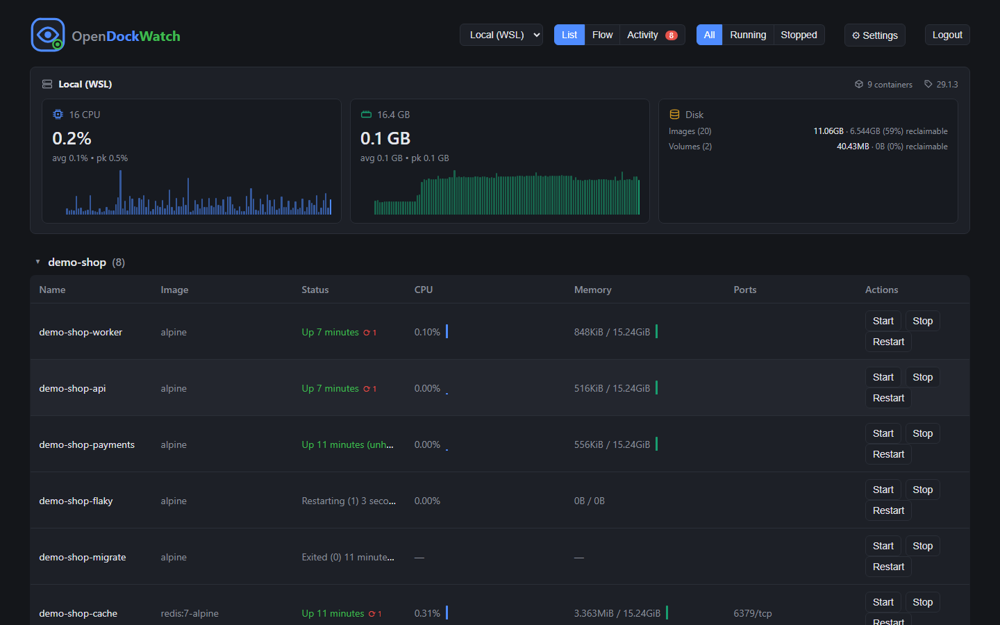
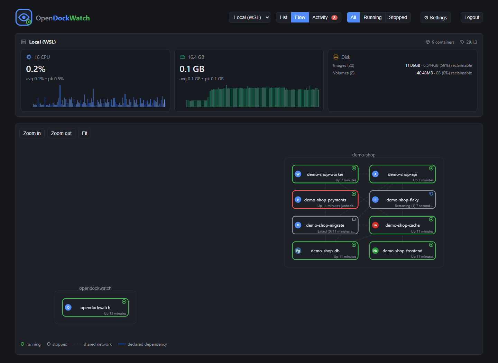
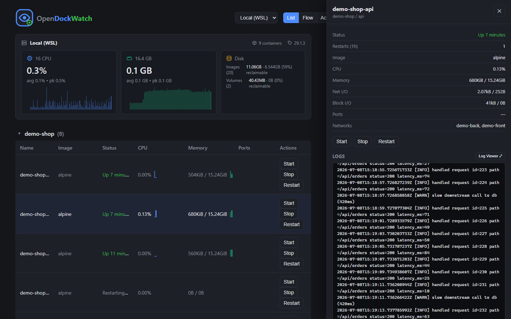
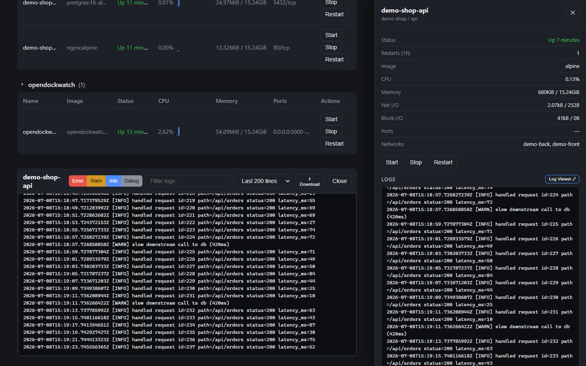

# OpenDockWatch

A small self-hosted Docker dashboard: containers grouped by Compose project, CPU/memory stats, start/stop/restart, live log tailing, and an ArgoCD-style topology view of how containers relate to each other. Works against the local Docker daemon and any number of remote hosts over SSH. No orchestration, no scheduling, no Kubernetes — just visibility and basic control, in the spirit of Dozzle.

## Features

- **List view** — containers grouped by `docker compose` project (collapsible), with live CPU/memory columns and Start/Stop/Restart actions. Filter by All / Running / Stopped.
- **Flow view** — a graph of containers (grouped visually by compose project) with zoom/fit controls. Each node shows a state indicator (running / restarting / paused / stopped) in the top-left corner and an uptime/status string in the bottom-right. Edges are drawn two ways:
  - **Auto**: containers sharing a custom Docker network are connected (works with zero config for anything started via the same compose file).
  - **Manual**: declared in `hosts.json` (`edges: [{ from, to, label }]`) for relationships Docker can't see itself — e.g. a non-dockerized frontend calling a backend API, or cross-project dependencies.
- **Details panel** — clicking a container (in either view) opens a side panel with status, image, CPU/mem, ports, networks, actions, and a small live log preview (last 100 lines).
- **Log pop-out** — expand the preview into a full-width bottom panel with a tail-size selector (100/200/1000/5000 lines — capped, never loads unbounded history) and a live text filter. The current tail can also be downloaded as a `.txt` file.

## Screenshots

**List view** — containers grouped by Compose project, live CPU/memory columns



**Flow view** — a topology graph of containers



**Details panel** — status, image, CPU/mem, ports, networks, actions, and a live log preview



**Log viewer** — full-width pop-out with level filters and download



## How it works

The server shells out to the `docker` CLI rather than talking to the Engine API directly. For remote hosts it passes `-H ssh://user@host` per request, which the Docker CLI resolves using your normal SSH client/config/keys — no extra tunneling code needed. This means:

- Local host: no `dockerHost` set, uses the default local socket.
- Remote hosts: reachable via key-based SSH the same way you'd already `ssh` into them.

## Requirements

- Node.js 20+
- `docker` CLI available on PATH, with access to the Docker socket
- For remote hosts: key-based SSH access (no password prompt) to a Docker socket on that host

## Setup

1. Install dependencies:
   ```
   npm install
   ```
2. Copy env and hosts config:
   ```
   cp .env.example .env
   cp config/hosts.example.json config/hosts.json
   ```
3. Edit `config/hosts.json` with your real hosts (local + any remote SSH targets).
4. Generate a password hash and fill in `.env`:
   ```
   npm run hash-password -- "your-password"
   ```
   Put the output in `AUTH_PASS_HASH`, set `AUTH_USER`, and set a random `SESSION_SECRET`. To also hand out read-only access (e.g. a wall display, or teammates who shouldn't get start/stop/restart), generate a second hash the same way and set `VIEWER_USER` / `VIEWER_PASS_HASH`.
5. Run:
   ```
   npm start
   ```
   Visit http://localhost:3000

## Running as a container

You can also run OpenDockWatch itself in a container, alongside everything else it's monitoring:

```
docker compose up -d --build
```

This mounts `/var/run/docker.sock` for local control and `~/.ssh` (read-only) so the container's `docker` CLI can reach remote hosts over SSH the same way your host user would. If Docker runs inside WSL (rather than Docker Desktop), run this from within your WSL distro so the socket path lines up.

## Remote hosts

Any host you can `ssh user@host` into (with a key, no password prompt) and that has a reachable Docker socket for that user can be added to `config/hosts.json`:

```json
{ "id": "prod", "name": "Production", "dockerHost": "ssh://deploy@prod.example.com" }
```

## Alerts

OpenDockWatch fires an alert (visible in the Activity tab, and via `GET /api/alerts`) for these rules:

| Rule                | Fires when                                                                             |
| ------------------- | -------------------------------------------------------------------------------------- |
| `container_crashed` | a container exits with a non-zero code (not from a manual stop/restart just before it) |
| `crash_loop`        | a container restarts 3+ times in 5 minutes, excluding manual restarts                  |
| `unhealthy`         | a container's healthcheck reports unhealthy                                            |
| `host_unreachable`  | a host stops responding to `docker version`                                            |
| `container_cpu`     | a container's CPU % stays over threshold for the sustain window                        |
| `container_mem`     | a container's mem % stays over threshold for the sustain window                        |
| `host_cpu`          | a host's normalized CPU % (sum of container CPU / core count) stays over threshold     |
| `host_mem`          | a host's summed container memory usage vs. total host memory stays over threshold      |
| `docker_disk`       | `docker system df`'s total footprint exceeds a threshold — see caveat below            |

The five threshold-based rules (`container_cpu`/`container_mem`/`host_cpu`/`host_mem`/`docker_disk`) are opt-in and disabled by default — set `ALERT_CPU_THRESHOLD`, `ALERT_MEM_THRESHOLD`, and/or `ALERT_DISK_THRESHOLD_GB` in `.env` (or from the Settings panel, see below) to enable them. `ALERT_SUSTAIN_MINUTES` (default 5, shared between the CPU and mem rules) avoids alerting on a single spike from an image build, cron job, or JVM startup — a value has to stay over threshold continuously for that long before it fires.

Some caveats worth knowing:

- CPU % is raw `docker stats` CPU (per-core cumulative) — a container fully using 4 cores reads 400%, matching what the UI already shows. It is not normalized by core count.
- Mem % is `docker stats` MemPerc, computed against a container's own memory limit. A container with no limit set reads low against host total and rarely trips `container_mem` — in practice this focuses the rule on containers that do have limits, which is where memory pressure actually OOMKills.
- `docker_disk` is Docker's own footprint (images, containers, volumes, build cache) — Docker doesn't report host filesystem free space, so this can't be a true "disk almost full" alert. Treat it as a prune reminder.
- Skip threshold alerts for a single container entirely with the `opendockwatch.alerts=off` label (`docker run --label opendockwatch.alerts=off ...` or the equivalent in a compose file).

Set `ALERT_WEBHOOK_URL` in `.env` to also get a push notification on any of the rules above. The destination and payload are picked from the URL's scheme, so one config value is enough — no separate format setting per service:

| Scheme        | Example                                                                                                                                                                                          |
| ------------- | ------------------------------------------------------------------------------------------------------------------------------------------------------------------------------------------------ |
| Discord       | `discord://<webhook_id>/<webhook_token>`                                                                                                                                                         |
| ntfy          | `ntfy://ntfy.sh/mytopic` (or a self-hosted server: `ntfy://ntfy.example.com/mytopic`)                                                                                                            |
| Gotify        | `gotify://<host>/<token>` (http) or `gotifys://<host>/<token>` (https)                                                                                                                           |
| Slack         | any `https://hooks.slack.com/...` incoming webhook URL — auto-detected                                                                                                                           |
| Anything else | posted as generic JSON (the alert object). Set `ALERT_WEBHOOK_FORMAT=slack` to force the Slack `{text}` shape for a Slack-compatible endpoint that isn't on `hooks.slack.com` (e.g. Mattermost). |

Instead of (or in addition to) `.env`, an admin account can set the webhook and the resource thresholds from the UI: the ⚙ Settings button in the topbar opens a panel to save them, clear an override back to the `.env` default, and (for the webhook) send a test alert. Values saved from the UI are stored in the database and take effect immediately (no restart) — a saved value always wins over `.env`, even set to empty/0 to deliberately disable something `.env` configured.

## Notes

- `name` is optional for local (non-SSH) hosts — if omitted, it's auto-filled from the machine's real hostname via `docker info`. Remote SSH hosts still need an explicit `name` since there's no local machine to introspect.
- `config/hosts.json` is gitignored since it may contain internal hostnames — only `hosts.example.json` is committed.
- Logs are streamed via Server-Sent Events (`docker logs -f --timestamps`), stdout and stderr both included.
- Actions are limited to `start` / `stop` / `restart` — no `rm`, by design.
- The optional viewer login (`VIEWER_USER`/`VIEWER_PASS_HASH`) can see everything but gets a 403 from the server (not just a hidden button) on any start/stop/restart request — enforced server-side, not just in the UI.

## Contributing

Issues and PRs welcome — see [CONTRIBUTING.md](CONTRIBUTING.md) for dev setup.

## License

AGPL-3.0-or-later. See [LICENSE](LICENSE). You're free to use, self-host, and modify OpenDockWatch, including internally within an organization. If you distribute a modified version, or run a modified version as a service that other people/users interact with over a network, you must make that modified source available to them under the same license.
